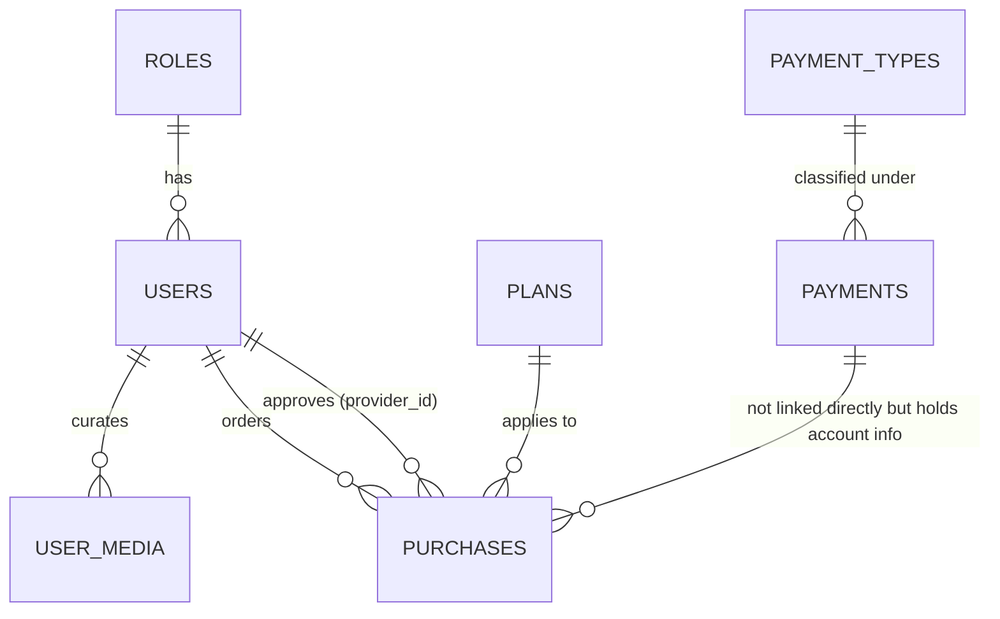

# CinePrism - Backend REST API Specification

CinePrism is a premium cinematic movie and TV show streaming application. The backend is built using the Laravel framework, exposing a stateless RESTful API secured by JWT authentication, with real-time transactional updates driven by Laravel Reverb.

---

## 1. Core Technology Stack

*   **Framework:** Laravel 11.x
*   **Language:** PHP 8.2+
*   **Authentication:** JWT-Auth via `tymon/jwt-auth`
*   **WebSockets Server:** Laravel Reverb (first-party WebSocket server)
*   **Database ORM:** Eloquent ORM
*   **API Integrations:** External TMDB API v3
*   **Caching Engine:** Laravel Cache (configured for 12-hour/24-hour response caching)

---

## 2. Directory & Model Architecture

The codebase follows the standard Laravel directory structure:

```
app/
├── Http/
│   ├── Controllers/      # Request handlers (AuthController, MediaController, etc.)
│   └── Middleware/       # Middleware layer (AdminMiddleware)
├── Models/               # Eloquent Models (User, UserMedia, Plan, Payment, PaymentType, Purchase, Role)
├── Policies/             # Authorization Policies (UserPolicy)
├── Providers/            # Service Providers (BroadcastServiceProvider)
├── Services/             # External Integrations (TMDBService)
├── Events/               # Real-time Broadcast Events (PurchaseApproved, PurchaseRejected)
├── Mail/                 # Email templates (OtpMail)
routes/
├── api.php               # REST API route mappings
└── channels.php          # WebSocket channel authentication definitions
database/
├── migrations/           # Database schema files
└── seeders/              # Initial seed scripts (DatabaseSeeder, RoleSeeder, UserSeeder, PlanSeeder, PaymentSeeder, PurchaseSeeder)
```

---

## 3. Database Schema & Models

The backend database models are designed around subscription features, user list curation, and hierarchical authorization.



### 3.1. Tables Reference

#### `roles`
*   `id` (BigInt, Primary Key)
*   `name` (String, Unique) — Seeded with:
    *   `user` (ID 1)
    *   `admin` (ID 2)
    *   `super_admin` (ID 3)
*   `created_at` / `updated_at` (Timestamps)

#### `users`
*   `id` (BigInt, Primary Key)
*   `role_id` (BigInt, Foreign Key to `roles.id`)
*   `name` (String)
*   `email` (String, Unique) — Required to match `/^.+@gmail\.com$/i` regex on registration.
*   `email_verified_at` (Timestamp, Nullable)
*   `password` (String) — Hashed.
*   `is_vip` (Boolean) — Default: `false`.
*   `vip_expires_at` (Date, Nullable)
*   `remember_token` (String, Nullable)
*   `created_at` / `updated_at` (Timestamps)

#### `user_media`
*   `id` (BigInt, Primary Key)
*   `user_id` (BigInt, Foreign Key to `users.id`, Cascades on Delete)
*   `list_type` (Enum: `favorite`, `watchlist`, `recent`)
*   `media_type` (Enum: `movie`, `tv`)
*   `tmdb_id` (Integer)
*   `title` (String, Nullable)
*   `poster_path` (String, Nullable)
*   `vote_average` (Float, Nullable)
*   `created_at` / `updated_at` (Timestamps)
*   *Unique index on `[user_id, list_type, media_type, tmdb_id]` ensures no duplicate entries.*

#### `plans`
*   `id` (BigInt, Primary Key)
*   `name` (String) — E.g., "Basic Plan", "Standard Plan", "Premium Plan"
*   `amount` (Integer) — Price of the plan in local currency (MMK).
*   `month` (Integer) — Duration parameter. 
    > [!WARNING]
    > **Seeder/Controller Mismatch:** The seeder populates this field as days (30, 90, 365), but the `PurchaseController` processes it as months using Carbon's `addMonths()`, resulting in a significantly longer VIP duration than intended.
*   `created_at` / `updated_at` (Timestamps)

#### `payment_types`
*   `id` (BigInt, Primary Key)
*   `name` (String) — Seeded with:
    *   `KBZ Pay`
    *   `Wave Money`
    *   `AYA Pay`
*   `logo_url` (String, Nullable) — Default icons loaded from seeders.
*   `created_at` / `updated_at` (Timestamps)

#### `payments`
*   `id` (BigInt, Primary Key)
*   `payment_type_id` (BigInt, Foreign Key to `payment_types.id`, Cascades on Delete)
*   `name` (String) — E.g., "U Mg Mg (Admin)", "Daw Hla Hla (Admin)"
*   `number` (String) — Phone number/account number for transfers.
*   `created_at` / `updated_at` (Timestamps)

#### `purchases`
*   `id` (BigInt, Primary Key)
*   `user_id` (BigInt, Foreign Key to `users.id`, Cascades on Delete)
*   `plan_id` (BigInt, Foreign Key to `plans.id`, Cascades on Delete)
*   `provider_id` (BigInt, Nullable, Foreign Key to `users.id`, Cascades on Delete) — The admin user processing the transaction.
*   `photo` (String, Nullable) — File path of the receipt screenshot stored in `public/purchases`.
*   `status` (Enum: `pending`, `approved`, `rejected`) — Default: `pending`.
*   `created_at` / `updated_at` (Timestamps)

---

## 4. API Reference & Route Mapping

All endpoints are prefixed with `/api` and return JSON responses.

### 4.1. Public Routes

| Endpoint | Method | Controller Action | Description / Parameters / Validation | Success Response | Error Response |
| :--- | :--- | :--- | :--- | :--- | :--- |
| `/register` | `POST` | `AuthController@register` | Initiates OTP registration. Validates email formatting.<br><br>**Validation:**<br>- `email` (required, email, unique:users, regex: `/^.+@gmail\.com$/i`) | `{"message": "Code sent to email"}` (HTTP 200) | `{"errors": "<error_message>"}` (HTTP 422)<br>`{"message": "Failed to send code", "error": "..."}` (HTTP 500) |
| `/verify-code` | `POST` | `AuthController@verifyCode` | Validates OTP and registers the user. Clears OTP cache.<br><br>**Validation:**<br>- `name` (required, string, max:255)<br>- `email` (required, email, unique:users)<br>- `password` (required, string, min:6)<br>- `code` (required, must match cached code) | `{"message": "Registration successful", "access_token": "...", "user": {...}}` (HTTP 201) | `{"message": "Invalid verification code"}` (HTTP 400)<br>Standard validation error (HTTP 422) |
| `/login` | `POST` | `AuthController@login` | Standard login returning JWT token.<br><br>**Request Body:**<br>- `email` (required, string)<br>- `password` (required, string) | `{"access_token": "...", "token_type": "bearer", "expires_in": 3600, "user": {...}}` (HTTP 200) | `{"error": "Invalid email or password"}` (HTTP 401) |
| `/refresh` | `POST` | `AuthController@refresh` | Issues a refreshed JWT access token. | `{"access_token": "...", "token_type": "bearer", "expires_in": 3600, "user": {...}}` (HTTP 200) | `{"error": "Refresh token expired or invalid"}` (HTTP 401) |
| `/media/trending` | `GET` | `MediaController@trending` | Fetches daily trending media from TMDB.<br><br>**Query Params:**<br>- `page` (optional, default 1) | `{"results": [...], "total_pages": ...}` (HTTP 200) | Cache hit or TMDB server issue. |

### 4.2. Authenticated Routes (Requires `auth:api` middleware)

All endpoints below require a valid `Authorization: Bearer <JWT_TOKEN>` header.

| Endpoint | Method | Controller Action | Description / Parameters / Validation | Success Response | Error Response |
| :--- | :--- | :--- | :--- | :--- | :--- |
| `/profile` | `GET` | `AuthController@profile` | Returns profile of the authenticated user. | `{"success": true, "user": {...}}` (HTTP 200) | `{"message": "User not found"}` (HTTP 404) |
| `/logout` | `POST` | `AuthController@logout` | Invalidates current JWT token. | `{"message": "Successfully logged out"}` (HTTP 200) | Authorization token required. |
| `/users` | `GET` | `UserController@index` | Lists system users. Enforces scoping based on roles: <br>- Admins (`role_id` 2) see regular users (`role_id` 1).<br>- Super Admins (`role_id` 3) see users and Admins (`role_id` 1 & 2). | `{"status": true, "data": [...]}` (HTTP 200) | Authorization token required. |
| `/users/{id}/change-profile` | `PATCH` | `UserController@changeProfile` | Updates name, email, or role ID.<br><br>**Validation:**<br>- `name` (sometimes, string, max:255)<br>- `email` (sometimes, email, unique, regex: `/^.+@gmail\.com$/i`) <br>- `role_id` (sometimes, in:1,2,3 - only if admin modifying someone else)<br>- `current_password` (required if self-updating or target is equal/higher authority, and changing email) | `{"message": "Updated successfully", "user": {...}}` (HTTP 200) | `{"message": "Incorrect password"}` (HTTP 422) |
| `/users/{id}/change-password` | `PATCH` | `UserController@changePassword` | Updates user password.<br><br>**Validation:**<br>- `password` (required, min:8, confirmed)<br>- `current_password` (required only if self-updating same-role user) | `{"message": "Password has been updated successfully."}` (HTTP 200) | `{"message": "The current password you entered is incorrect."}` (HTTP 422) |
| `/media/popular/{type}` | `GET` | `MediaController@popular` | Returns popular movies or TV shows (paginated).<br><br>**Route Parameters:**<br>- `type` ('movie' or 'tv')<br>**Query Params:**<br>- `page` (optional, default 1) | `{"results": [...], "total_pages": ...}` (HTTP 200) | `{"error": "Invalid media type"}` (HTTP 400) |
| `/media/search` | `GET` | `MediaController@search` | Performs multi-search on TMDB API.<br><br>**Query Params:**<br>- `query` (required, string)<br>- `page` (optional, default 1) | `{"results": [...], "total_pages": ...}` (HTTP 200) | Standard response. |
| `/media/genres/{type}` | `GET` | `MediaController@genres` | Lists movie/TV genre tags.<br><br>**Route Parameters:**<br>- `type` ('movie' or 'tv') | `{"results": [{"id": ..., "name": ...}], "response": ...}` (HTTP 200) | `{"error": "Invalid type"}` (HTTP 400) |
| `/media/genre/{type}/{genreId}` | `GET` | `MediaController@byGenre` | Lists paginated movies/TV by genre ID.<br><br>**Route Parameters:**<br>- `type` ('movie' or 'tv')<br>- `genreId` (integer)<br>**Query Params:**<br>- `page` (optional, default 1) | `{"results": [...], "total_pages": ...}` (HTTP 200) | `{"error": "Invalid type"}` (HTTP 400) |
| `/media/detail/{type}/{id}` | `GET` | `MediaController@details` | Returns details, appending credits, trailer videos, and recommendations.<br><br>**Route Parameters:**<br>- `type` ('movie' or 'tv')<br>- `id` (integer) | Detailed nested JSON (HTTP 200) | `{"error": "Invalid media type"}` (HTTP 400) |
| `/user/lists/{type}` | `GET` | `UserMediaController@index` | Retrieves favorite, watchlist, or recent items.<br><br>**Route Parameters:**<br>- `type` ('favorite', 'watchlist', or 'recent') | `{"results": [...]}` (HTTP 200) | Authorization token required. |
| `/user/lists/{type}` | `POST` | `UserMediaController@store` | Adds movie/TV details to lists (capped at max 20 items per list).<br><br>**Route Parameters:**<br>- `type` ('favorite', 'watchlist', or 'recent')<br>**Validation:**<br>- `media_type` (required, 'movie' or 'tv')<br>- `tmdb_id` (required, integer) | `{"message": "Added", "result": 5}` (HTTP 200) | `{"message": "limit reached"}` (HTTP 200) |
| `/user/lists/{type}/{media_type}/{tmdb_id}` | `DELETE` | `UserMediaController@destroy` | Removes item from the user's specific collection list. | `{"message": "Successfully Removed"}` (HTTP 200) | Authorization token required. |
| `/plans` | `GET` | `PlanController@index` | Lists active subscription plans. | `{"status": true, "data": [...]}` (HTTP 200) | Authorization token required. |
| `/payments` | `GET` | `PaymentController@index` | Lists payment accounts loading payment type relation. | `{"status": true, "data": [...]}` (HTTP 200) | Authorization token required. |
| `/purchases` | `GET` | `PurchaseController@index` | Lists all user purchases. | `{"status": true, "data": [...]}` (HTTP 200) | Authorization token required. |
| `/purchases` | `POST` | `PurchaseController@store` | Submits purchase transaction request with screenshot receipt.<br><br>**Validation:**<br>- `plan_id` (required, exists:plans,id)<br>- `photo` (required, image: jpg, jpeg, png, max:10MB) | `{"message": "Purchase submitted. Awaiting admin approval.", "purchase": {...}}` (HTTP 201) | Standard validation error (HTTP 422) |

### 4.3. Admin Routes (Requires `auth:api` and `admin` middlewares)

Requires standard JWT authorization and checking that user is an Admin or Super Admin (`role_id` 2 or 3).

| Endpoint | Method | Controller Action | Description / Parameters / Validation | Success Response | Error Response |
| :--- | :--- | :--- | :--- | :--- | :--- |
| `/purchases/{id}/approve` | `PATCH` | `PurchaseController@approve` | Approves receipt, sets `is_vip` to 1, increases user's `vip_expires_at` date, and fires `purchase.approved` WebSocket broadcast.<br><br>**Validation:**<br>- `provider_id` (required, exists:users,id) | `{"status": true, "message": "Purchase approved successfully", "customer": {...}}` (HTTP 200) | `{"status": false, "message": "Purchase already processed"}` (HTTP 400) |
| `/purchases/{id}/reject` | `PATCH` | `PurchaseController@reject` | Rejects receipt, sets status, and fires `purchase.rejected` WebSocket broadcast.<br><br>**Validation:**<br>- `provider_id` (required, exists:users,id) | `{"status": true, "message": "Purchase rejected"}` (HTTP 200) | `{"status": false, "message": "Purchase already processed"}` (HTTP 400) |
| `/plans` | `POST` | `PlanController@add` | Adds a new subscription plan.<br><br>**Validation:**<br>- `name` (sometimes, string)<br>- `amount` (sometimes, integer)<br>- `month` (sometimes, integer) | `{"status": true, "message": "Plan created successfully", "data": {...}}` (HTTP 201) | `{"message": "Unauthorized. Admin access required."}` (HTTP 403) |
| `/plans/{id}` | `PATCH` | `PlanController@change` | Updates an existing subscription plan option.<br><br>**Validation:** same as add plan. | `{"message": "Plan updated successfully", "data": {...}}` (HTTP 200) | `{"message": "Unauthorized. Admin access required."}` (HTTP 403) |
| `/plans/{id}` | `DELETE` | `PlanController@delete` | Deletes a subscription plan option. | `{"status": true, "message": "Plan deleted successfully"}` (**HTTP 201**) | `{"message": "Unauthorized. Admin access required."}` (HTTP 403) |
| `/payments` | `POST` | `PaymentController@add` | Configures a new payment gateway account.<br><br>**Validation:**<br>- `payment_type_id` (sometimes, exists:payment_types,id)<br>- `name` (sometimes, string, unique:payments,name)<br>- `number` (sometimes, string, unique:payments,number) | `{"status": true, "message": "Payment created successfully", "data": {...}}` (HTTP 201) | `{"message": "Unauthorized. Admin access required."}` (HTTP 403) |
| `/payments/{id}` | `PATCH` | `PaymentController@change` | Updates a payment account.<br><br>**Validation:**<br>- `payment_type_id` (sometimes, exists:payment_types,id)<br>- `name` (sometimes, string, unique:payments,name except this ID)<br>- `number` (sometimes, string, unique:payments,number except this ID) | `{"status": true, "message": "Payment account added successfully", "data": {...}}` (HTTP 200) | `{"message": "Unauthorized. Admin access required."}` (HTTP 403) |
| `/payments/{id}` | `DELETE` | `PaymentController@delete` | Deletes a payment account configuration. | `{"status": true, "message": "Payment deleted successfully"}` (**HTTP 201**) | `{"message": "Unauthorized. Admin access required."}` (HTTP 403) |

---

## 5. Key Tech Implementations

### 5.1. TMDB API Client with Caching
All external calls to TMDB go through `App\Services\TMDBService`. The service calls the REST v3 endpoints and uses Laravel's `Cache::remember` logic to reduce latency and satisfy rate limiting constraints:
*   **Genre listings:** Capped at 24 hours caching.
*   **Spotlight/Details, Searches, Grids, and Rows:** Cached for 12 hours.
*   **Media Detail Hydration:** Leverages TMDB's `append_to_response` parameter to fetch video clips, recommendations, and credits within a single API request.

### 5.2. Personal Collection List Caps
In `UserMediaController`, users are restricted to a maximum of **20 items** under each collection list type (`favorite`, `watchlist`, `recent`). If the count exceeds this limit, insertions are blocked and a JSON response with `message => limit reached` is returned.

### 5.3. Real-time Transaction Notifications (Reverb Broadcast)
When a user submits a VIP subscription payment request, they upload a screenshot of their transaction. Once an administrator processes this request, the backend fires a broadcast event over a private WebSockets channel:
*   **Channel Definition:** `App.Models.User.{id}` (authenticated in `routes/channels.php` to match `user_id` of target).
*   **Event `PurchaseApproved`**: Broadcasted as `purchase.approved`. On receipt, the client receives the updated `User` object (`is_vip: 1`, `vip_expires_at` timestamp), triggering immediate UI unlock.
    *   *Payload:* `{"purchase_id": <int>, "user": <User object>}`
*   **Event `PurchaseRejected`**: Broadcasted as `purchase.rejected` to notify the client of transaction failure.
    *   *Payload:* `{"purchase_id": <int>}`

### 5.4. Role-Based Authorization & Policies
Security is enforced using custom Middleware and Authorization Policies:
*   **AdminMiddleware:** Restricts routes by retrieving the authenticated user via `'api'` JWT guard and checking if they have administrative privileges using `$user->isAdmin()`. (Admins and Super Admins possess `role_id` 2 and 3 respectively).
*   **UserPolicy (`app/Policies/UserPolicy.php`):**
    *   Checks if the authenticated user (`$auth`) is authorized to modify the target user (`$target`).
    *   **Rule:** `$auth->id === $target->id || $auth->role_id > $target->role_id`. This allows users to update themselves, and allows managers higher in the hierarchy to update those below them (Super Admin > Admin > User).

### 5.5. OTP Registration & Verification Flow
*   **OTP Generation:** A random 6-digit integer `rand(100000, 600000)` is generated.
*   **Storage:** Cached in Laravel Cache with the key `verification_code_{email}` for a strict **5 minutes** duration.
*   **Delivery:** Sent via a queued email `App\Mail\OtpMail` with the subject "Verification Code" containing an HTML body with the code.
*   **Uniqueness & Validation:** Registration requires a unique email matching the Gmail domain (`/^.+@gmail\.com$/i`). If successfully verified, the cache key is cleared immediately, and the new user account is committed to the database.
